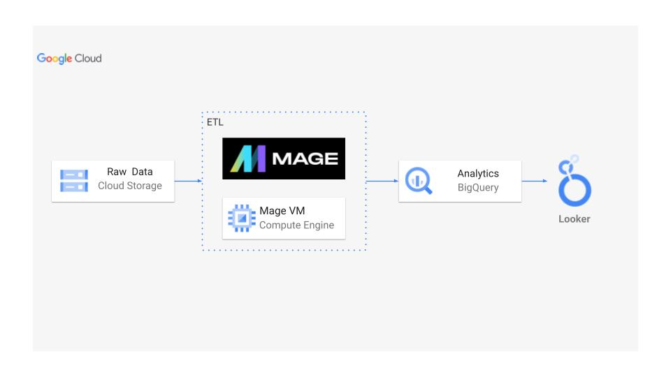

# Uber Data Analytics | Moadern Data Engineering - GCP Project 

## Introduction
Designed and implemented a scalable cloud-based data engineering pipeline using Mage.ai for orchestration, Google Cloud Storage (GCS) for raw data ingestion, BigQuery for data warehousing, and Looker Studio for interactive dashboards and reporting.

The pipeline automates data ingestion, transformation, storage, and visualization to enable real-time business insights.

## Architecture

## Technology used
1. Language used - Python
2. Scripting Language - SQL
3. Google cloud platform
    - BigQuery
    - Cloud Storage
    - Looker Studio
    - Compute Instance

4.Mage.AI (Modern Data Pipeline tool)

**Modern Data Pipeline Tool** - https://www.mage.ai/

## Data Set used
TLC Trip Record Data

Yellow and green taxi trip records include fields capturing pick-up and drop-off dates/times, pick-up and drop-off locations, trip distances, itemized fares, rate types, payment types, and driver-reported passenger counts.

Here is the dataset used in the video - ## Dataset Used

TLC Trip Record Data

Yellow and green taxi trip records include fields capturing pick-up and drop-off dates/times, pick-up and drop-off locations, trip distances, itemized fares, rate types, payment types, and driver-reported passenger counts.

Here is the dataset used in the video - https://github.com/darshilparmar/uber-data-engineering-mage-project/blob/main/data/uber_data.csv

### More info about Dataset
1.Original Data Source - https://www.nyc.gov/site/tlc/about/tlc-trip-record-data.page

2.Data Dictionary - https://www.nyc.gov/assets/tlc/downloads/pdf/data_dictionary_trip_records_yellow.pdf

## Data Model

## Scripts for Project
  1.[Extract Python File](mage-files/extract.py)

  2.[Load Python File](mage-files/load.py)
 
  3.[Transform Python File](mage-files/transform.py)

